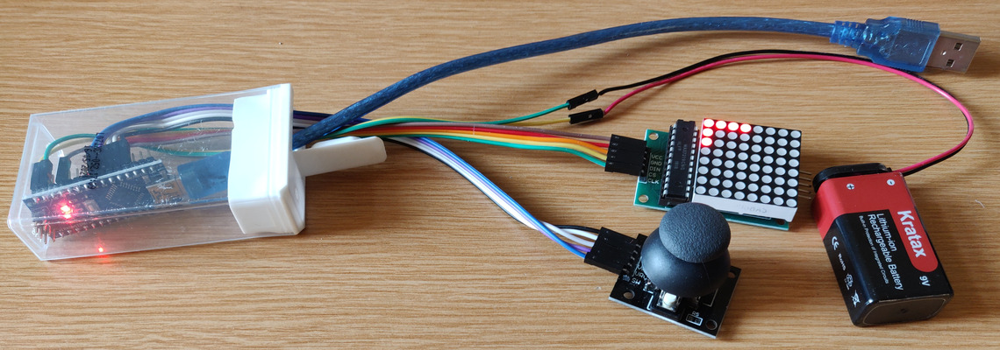

BTAnim
======

## Edit animations on an Arduino with an 8x8 LED matrix

* Start with an Arduino Nano or Uno
* Attach a MAX7219 driven 8x8 LED matrix
    * VCC to 5V
    * GND to GND
    * DIN to D2
    * CS to D3
    * CLK to D4
* Attach a mini joystick with a two-way rocker & push button
    * GND to A0 (or GND)
    * +5V to A1 (or 5V)
    * VRx to A2
    * VRy to A3
    * SW to A4
* Optionally attach an external power source to GND & VIN
* Flash the included btanim.ino to the Arduino
* When powering up, the device is in preview mode. Push the joystick up & down to speed up or slow down the animation. Push it to the left & right to manually advance frames. Click the joystick to switch to edit mode.
* In edit mode, the joystick moves the cursor and clicking toggles the active pixel. Leaving the screen vertically returns to preview mode while leaving horizontally advances to the next or previous frame. A blank frame is automatically added to or removed from the end as needed.
* You can save the current animation using the "save" command from a serial terminal (at 9600 baud rate). The output should begin with "load:" and is itself a valid command to reload the animation at a later time or on a different device. Alternatively, you may use the bundled gif-export.py utility to convert it to a gif file.

